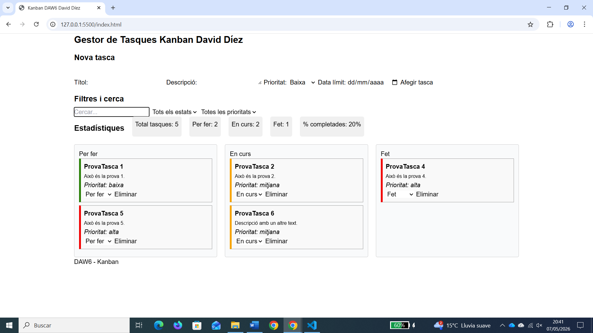
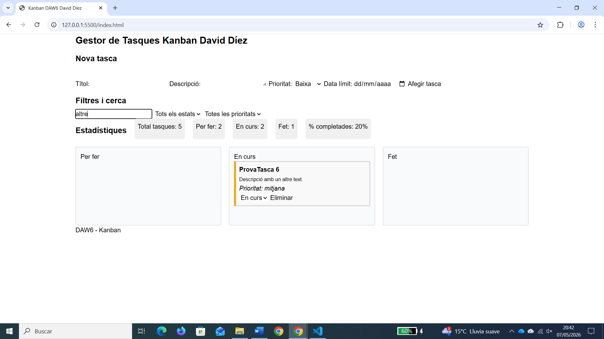
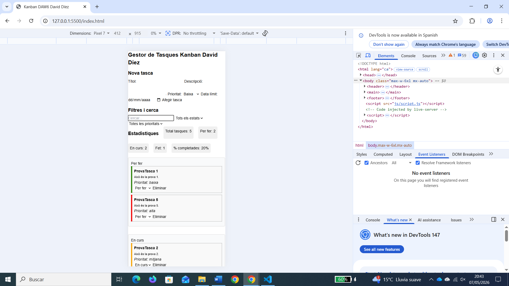

# 🗂️ Gestor de Tasques Kanban – David Díez (DAW6)

## 📌 Descripció

Aplicació web de gestió de tasques tipus Kanban desenvolupada amb HTML, CSS, JavaScript i Tailwind.

Permet organitzar tasques en tres columnes:

* Per fer
* En curs
* Fet

Les dades es guarden amb localStorage i es mantenen després de recarregar la pàgina.

---

## ⚙️ Funcionalitats

* Crear, eliminar i gestionar tasques
* Canviar l’estat de les tasques
* Filtres per estat i prioritat
* Cerca per text
* Estadístiques en temps real
* Persistència de dades
* Disseny responsive

---

## 🧭 Guia d’ús

* Afegir tasca → formulari
* Canviar estat → selector
* Eliminar → botó
* Filtrar/cercar → secció de filtres

---

## 📁 Estructura

```
index.html
css/estils.css
js/script.js
img/
README.md
```

---

## 🌐 Enllaços

* 🔗 Repositori:
  👉 https://github.com/daviddiezdaw/kanban-david-diez-daw6

* 🚀 Aplicació desplegada:
  👉 (pendent de desplegament)

---

## 🖼️ Captures

### Vista general



### Filtres i cerca



### Vista mòbil



---

## 🧠 Notes

El projecte es va desenvolupar inicialment amb CSS i posteriorment es va integrar Tailwind per adaptar el layout i complir els requisits de l’enunciat.

---

## 👨‍💻 Autor

David Díez
DAW6
